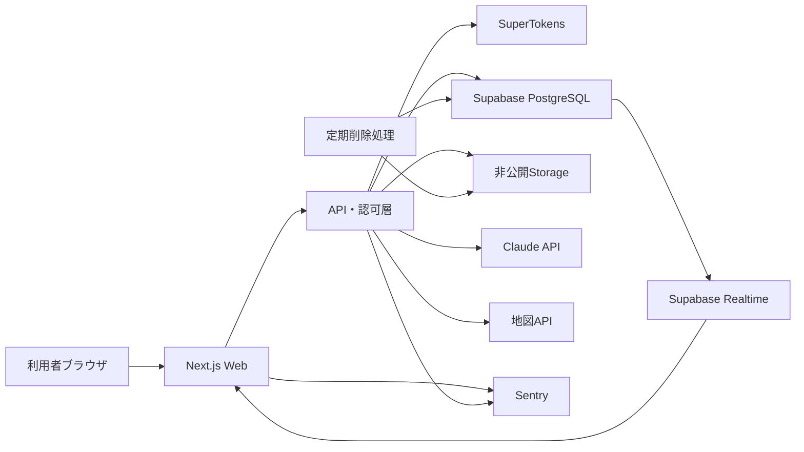

# 技術要件定義書（MVP版）

## 1. 文書情報

| 項目 | 内容 |
|---|---|
| 文書名 | 技術要件定義書（MVP版） |
| 対象 | 地域助け合い・ボランティア実績可視化サービス |
| 対象工程 | MVP設計・実装・試験 |
| プラットフォーム | レスポンシブWebアプリ |

## 2. システム概要

地域住民が投稿した小規模な困りごとに大学生が応募し、依頼者が支援者を選択するWebサービスである。活動完了後、LLMが活動内容と評価を基に支援実績を生成し、プロフィールへ蓄積する。

## 3. 開発スコープ

### 3.1 MVP対象

- レスポンシブWebアプリ
- スマートフォンブラウザ優先
- PCブラウザ対応
- PWA化は任意
- ネイティブiOS・Androidアプリは対象外

### 3.2 対象ブラウザ

- Chrome 最新2バージョン
- Safari 最新2バージョン
- Edge 最新2バージョン
- Android Chrome
- iOS Safari

### 3.3 対象機能

- ユーザー登録・ログイン
- プロフィール管理
- 大学生・本人確認申請
- 依頼作成・AI構造化
- 依頼一覧・検索
- 応募・支援者選択
- マッチ成立
- チャット
- 完了報告・相互確認
- 感謝コメント・評価
- AI実績プロフィール
- 通報・ブロック
- 管理画面
- 操作・監査ログ
- 音声入力（優先度P1）

### 3.4 MVP対象外

- ネイティブアプリ
- 金銭報酬・決済
- 保険・補償制度
- 電話・画面共有
- 介護・医療・電気工事などの専門作業
- 高所作業、危険工具を使う作業
- 金銭管理、送迎、買い物代行

## 4. 推奨システム構成

| レイヤー | 採用候補 | 用途 |
|---|---|---|
| フロントエンド | React Native・TypeScript | Web UI、SSR、API連携 |
| UI | Tailwind CSS | レスポンシブ対応 |
| API | Next.js Route Handlers | 認可、入力検証、業務処理 |
| DB | Supabase PostgreSQL | 業務データ保存 |
| ストレージ | Supabase Storage | 本人確認画像 |
| 認証 | SuperTokens | ログイン、セッション、MFA |
| AI | Claude API | 依頼構造化、危険判定補助、実績生成 |
| リアルタイム通信 | Supabase Realtime | チャット更新 |
| 地図 | Google Maps | 概算位置表示 |
| エラー監視 | Sentry | フロント・APIエラー監視 |
| ホスティング | Vercel | Web・API配信 |
| 定期処理 | Vercel Cron等 | 画像削除、期限切れ処理 |




## 5. ユーザー種別・権限

| 操作 | 依頼者 | 支援者 | 管理者 | 本人確認担当者 |
|---|---:|---:|---:|---:|
| 依頼作成 | 可 | 可 | 可 | 不可 |
| 依頼閲覧 | 可 | 可 | 可 | 不可 |
| 応募 | 可 | 可 | 可 | 不可 |
| 応募者選択 | 自分の依頼のみ | 不可 | 例外対応のみ | 不可 |
| チャット | 成立した当事者のみ | 成立した当事者のみ | 通報調査時のみ | 不可 |
| 完了確認 | 当事者のみ | 当事者のみ | 例外対応 | 不可 |
| 本人確認申請 | 可 | 可 | 不可 | 不可 |
| 証明書画像閲覧 | 不可 | 不可 | 原則不可 | 可 |
| 投稿停止・利用停止 | 不可 | 不可 | 可 | 不可 |
| 監査ログ閲覧 | 不可 | 不可 | 可 | 本人確認分のみ |

権限は画面表示だけでなく、APIおよびDBアクセスで検証する。

## 6. 認証・本人確認要件

### 6.1 認証

- メールアドレスとパスワードで登録する。
- 大学生は大学ドメインのメール認証を優先する。
- セッションはHttpOnly、Secure、SameSite属性付きCookieで管理する。
- 管理者と本人確認担当者にはMFAを必須とする。
- ログイン試行回数を制限する。
- パスワード再設定時は既存セッションを失効させる。
- 権限はサーバー側で確認する。

### 6.2 本人確認

- MVPでは大学メール認証または学生証確認を基本とする。
- マイナンバーカード画像の自前保存は原則として採用しない。
- 公的証明書が必要な場合は外部eKYC事業者を優先する。
- 自前確認を行う場合、証明書画像は非公開バケットに保存する。
- クライアントへストレージの直接参照権限を与えない。
- 担当者は短時間有効な署名付きURLでのみ閲覧する。
- 承認・否認後7日以内に画像を自動削除する。
- 閲覧、承認、否認、削除を監査ログへ記録する。

SuperTokensは認証・セッション管理であり、本人確認機能ではない。`email_verified`と`verification_status`は別々に保持する。

## 7. 機能要件

### F-01 依頼作成・AI構造化

#### 入力

- 自由記述
- 希望日時
- 概算地域
- 任意の画像
- 音声入力（P1）

#### AI抽出項目

- タイトル
- 作業内容
- カテゴリ
- 希望日時
- 所要時間
- 概算地域
- 必要人数
- 持ち物
- 注意事項
- 危険候補
- 不足項目

#### 処理

1. 入力から氏名、電話番号、詳細住所などを可能な範囲でマスクする。
2. LLMへ構造化を要求する。
3. JSON Schemaで応答を検証する。
4. 不足項目がある場合は一度に1問だけ追加質問する。
5. 固定ルールとLLMで危険性を判定する。
6. 構造化結果をユーザーへ提示する。
7. ユーザーの確認後に公開する。

#### 例外処理

- LLM応答が不正：最大2回再試行する。
- 再試行失敗：手入力フォームへ切り替える。
- 高危険：公開を拒否する。
- 判断不能：管理者審査へ送る。
- LLM停止中：AIなしの手動投稿を許可する。

AIが投稿内容を自動確定・公開してはならない。

### F-02 依頼一覧・検索

- 検索条件はカテゴリ、希望日時、概算距離、必要人数、本人確認状態とする。
- 初期表示は現在地または登録地域から近い順とする。
- 位置情報を拒否した場合は登録地域を使用する。
- 公開画面では番地を表示しない。
- 緯度・経度は丸めるか地域コードへ変換する。
- マッチ成立後も必要最小限の集合場所だけを開示する。
- 募集終了、停止、期限切れ依頼は応募不可とする。

### F-03 応募・マッチング

依頼者が応募者を選択してマッチを成立させる「依頼者選択式」とする。

#### 処理

1. 支援者が応募理由と対応可能日時を送信する。
2. 依頼者へ応募通知を送る。
3. 依頼者が応募者プロフィールと実績を確認する。
4. 依頼者が1人または必要人数分を選択する。
5. 選択された応募だけを成立状態へ変更する。
6. 募集人数到達後、未選択応募を自動終了する。
7. 成立した当事者だけにチャットを開放する。

#### 排他制御

複数端末から同時選択された場合に募集人数を超えないよう、DBトランザクション、行ロックまたは楽観ロックを使用する。

#### 応募制限

- 自分の依頼には応募不可
- 利用停止ユーザーは応募不可
- 期限切れ依頼には応募不可
- 同一依頼への重複応募不可
- 本人確認必須依頼には未確認ユーザーは応募不可

### F-04 チャット

- マッチ成立後から利用可能とする。
- 当事者以外は取得・送信できない。
- テキストをMVP対象とする。
- 画像送信はP1とする。
- 既読状態を保持する。
- 送信日時はサーバー時刻を使用する。
- 電話番号、口座番号、外部連絡先の投稿時に警告する。
- 通報されたメッセージは管理者が調査できる。

### F-05 完了確認

- 依頼者と支援者の双方が完了操作を行う。
- 片方のみの場合は`completion_pending`とする。
- 72時間応答がない場合はリマインドする。
- 認識が食い違う場合は`disputed`へ移行する。
- 完了確定後にレビューと実績生成を有効化する。

### F-06 評価・感謝

- 選択式評価と感謝コメントを使用する。
- 評価項目は時間厳守、丁寧さ、安全配慮、コミュニケーションとする。
- 同一マッチにつき各ユーザー1件とする。
- 投稿後の編集期限を設ける。
- 個人情報や攻撃的表現を検出する。
- 評価対象者は非公開申請または異議申立てができる。

### F-07 AI実績プロフィール

#### 入力

- 完了した依頼カテゴリ
- 活動日時・活動時間
- 支援内容
- 感謝コメント
- 選択式評価
- 過去実績

#### 出力

- 活動概要
- 発揮した強み
- 累計活動回数
- 累計活動時間
- カテゴリ別実績
- AI生成である旨

#### 制約

- 依頼者の氏名、住所、病歴などを出力しない。
- 完了確認済みの活動だけを集計する。
- AI文章は本人が確認してから公開する。
- 本人は再生成、非公開化できる。
- 実績の事実データはユーザーが自由に改変できない。
- 生成モデル、プロンプトバージョン、生成日時を記録する。

### F-08 通報・ブロック

#### 通報理由

- 詐欺
- ハラスメント
- 危険作業
- 虚偽情報
- 無断欠席
- 個人情報の要求
- 金銭要求
- その他

#### 要件

- 通報対象、理由、説明、証拠、日時を保存する。
- 緊急度に応じて管理者へ通知する。
- 高緊急度では対象依頼を自動的に一時非公開にする。
- ブロックした相手の依頼、応募、メッセージを非表示にする。
- 管理者の処置と理由を監査ログへ残す。

### F-09 管理画面

- ユーザー検索
- 依頼検索・公開停止
- 通報対応
- 利用停止
- 本人確認処理
- 危険判定待ちの確認
- 操作ログ閲覧
- 指標集計
- 削除処理状況の確認

## 8. 状態管理

### 8.1 依頼状態

```text
draft
→ pending_review
→ published
→ matching
→ matched
→ in_progress
→ completion_pending
→ completed
```

分岐状態：

```text
rejected / cancelled / expired / suspended / disputed
```

### 8.2 応募状態

```text
applied → selected → accepted → completed
        → not_selected
        → withdrawn
        → cancelled
```

### 8.3 本人確認状態

```text
unverified → pending → approved
                     → rejected
                     → expired
```

状態変更は専用API経由に限定し、不正な遷移をサーバー側で拒否する。

## 9. データ要件

### 9.1 `users`

- `id`
- `display_name`
- `role`
- `email_verified`
- `verification_status`
- `area_code`
- `birth_year`
- `status`
- `created_at`
- `updated_at`

性別はマッチングに不可欠でなければ収集しない。

### 9.2 `user_skills`

- `user_id`
- `skill_tag_id`
- `experience_level`

### 9.3 `requests`

- `id`
- `requester_id`
- `title`
- `original_text`
- `structured_content`
- `category_id`
- `risk_level`
- `area_code`
- `approximate_latitude`
- `approximate_longitude`
- `scheduled_at`
- `estimated_minutes`
- `required_helpers`
- `status`
- `version`
- `expires_at`
- `created_at`
- `updated_at`

### 9.4 `applications`

- `id`
- `request_id`
- `helper_id`
- `message`
- `available_at`
- `status`
- `created_at`

`request_id + helper_id`へ一意制約を設定する。

### 9.5 `matches`

- `id`
- `request_id`
- `helper_id`
- `application_id`
- `status`
- `matched_at`
- `completed_at`

### 9.6 `messages`

- `id`
- `match_id`
- `sender_id`
- `body`
- `sent_at`
- `read_at`
- `moderation_status`

### 9.7 `reviews`

- `id`
- `match_id`
- `reviewer_id`
- `reviewee_id`
- `evaluation`
- `comment`
- `created_at`

### 9.8 `achievement_profiles`

- `user_id`
- `generated_text`
- `visibility`
- `model_name`
- `prompt_version`
- `generated_at`
- `approved_at`

### 9.9 `verification_requests`

- `id`
- `user_id`
- `method`
- `storage_object_key`
- `status`
- `reviewer_id`
- `reviewed_at`
- `deletion_due_at`
- `deleted_at`

### 9.10 `reports`

- `id`
- `reporter_id`
- `target_type`
- `target_id`
- `reason`
- `description`
- `severity`
- `status`
- `handled_by`
- `created_at`
- `resolved_at`

### 9.11 `audit_logs`

- `id`
- `actor_id`
- `event_type`
- `target_type`
- `target_id`
- `result`
- `ip_hash`
- `user_agent`
- `created_at`

## 10. API要件

```text
POST   /api/auth/*
GET    /api/profile
PATCH  /api/profile

POST   /api/requests/structure
POST   /api/requests
GET    /api/requests
GET    /api/requests/{id}
PATCH  /api/requests/{id}
DELETE /api/requests/{id}

POST   /api/requests/{id}/applications
GET    /api/requests/{id}/applications
POST   /api/applications/{id}/select
POST   /api/applications/{id}/withdraw

GET    /api/matches/{id}
POST   /api/matches/{id}/messages
GET    /api/matches/{id}/messages
POST   /api/matches/{id}/complete
POST   /api/matches/{id}/dispute

POST   /api/matches/{id}/reviews
POST   /api/achievements/generate
PATCH  /api/achievements/visibility

POST   /api/verifications
POST   /api/reports
POST   /api/users/{id}/block
```

### 10.1 API共通要件

- JSON SchemaまたはZodで入力を検証する。
- 認証・認可をサーバー側で行う。
- エラー形式を統一する。
- 更新系APIにCSRF対策を施す。
- 重要操作には冪等性キーを使用する。
- 一覧APIはカーソル方式でページングする。
- レート制限を設定する。
- クライアント送信のユーザーIDと時刻を信用しない。

### 10.2 エラー形式

```json
{
  "error": {
    "code": "REQUEST_STATE_CONFLICT",
    "message": "依頼の状態が更新されているため処理できません",
    "details": {},
    "requestId": "trace_123"
  }
}
```

## 11. AI要件

### 11.1 構造化出力

- JSON Schema準拠の出力を要求する。
- モデルの自由文を直接DB項目へ保存しない。
- 出力値をサーバー側で再検証する。
- プロンプトインジェクションを前提に入力を扱う。
- ユーザー入力内の命令をシステム指示として解釈しない。

### 11.2 危険度

| 危険度 | 処理 |
|---|---|
| `low` | 通常公開 |
| `medium` | 注意事項を表示して公開 |
| `high` | 管理者審査 |
| `prohibited` | 投稿拒否 |

LLM判定だけに依存せず、禁止カテゴリ、時間帯、重量、高所、専門資格、金銭、医療・介護などを固定ルールで検査する。

### 11.3 個人情報保護

- LLM送信前に電話番号、メール、詳細住所、証明書番号をマスクする。
- 本人確認画像をLLMへ送信しない。
- LLM入出力の保存は必要最小限とする。
- 学習利用の有無をAPI事業者の契約条件で確認する。
- ログへアクセストークンや個人情報を出力しない。

## 12. セキュリティ要件

- OWASP ASVS Level 2を目標とする。
- PostgreSQLのRow Level Securityを設定する。
- Service Role Keyをブラウザへ配布しない。
- 秘密情報は環境変数またはSecret Managerで管理する。
- 本番・検証環境の秘密情報を分離する。
- 保存データと通信を暗号化する。
- ファイル形式、容量、拡張子、MIMEタイプを検証する。
- アップロード画像のメタデータを削除する。
- XSS、CSRF、SQLインジェクション対策を実施する。
- 管理操作を監査する。
- 依存パッケージの脆弱性を継続確認する。
- 個人情報をURL、エラーメッセージ、分析ログへ含めない。

## 13. 非機能要件

### 13.1 性能

- 通常API：95パーセンタイルで2秒以内
- 一覧初期表示：3秒以内
- チャット送信反映：2秒以内
- AI構造化：通常15秒以内
- 画像アップロード上限：1ファイル10MB
- MVP想定同時接続：100
- 一覧取得件数：1回20件

### 13.2 可用性

- コアタイム：9:00〜21:00
- 月間稼働率目標：99.0%
- 重大障害の検知：5分以内
- 重大障害の初動開始：30分以内
- AI障害時も手動投稿を継続可能とする。

### 13.3 バックアップ・復旧

- DBバックアップ：1日1回以上
- 目標復旧時点（RPO）：24時間以内
- 目標復旧時間（RTO）：8時間以内
- 復旧テスト：正式公開前に1回実施
- 本人確認画像はバックアップ対象外、または同じ削除期限を適用する。

### 13.4 アクセシビリティ

- WCAG 2.2 AAを目標とする。
- 本文文字サイズは16px以上とする。
- タップ領域を44×44px以上とする。
- 色だけで状態を表現しない。
- 音声入力結果を必ずテキストで確認できるようにする。
- エラー箇所と修正方法を文章で示す。
- 主要操作を片手で完結できる配置にする。

## 14. ログ・監視要件

### 14.1 記録対象

- ログイン、ログアウト、認証失敗
- 本人確認画像の閲覧、承認、削除
- 依頼の作成、編集、削除、公開停止
- 応募、選択、辞退、キャンセル
- 完了、異議申立て
- 通報、ブロック、利用停止
- AI呼び出しの成功、失敗、処理時間
- 音声認識の成功、失敗
- APIエラー
- 管理者操作

### 14.2 ログ記録禁止情報

- パスワード
- セッショントークン
- 証明書番号
- 証明書画像
- 詳細住所
- 未マスクのLLM入力

### 14.3 アラート条件

- 5分間のAPIエラー率5%以上
- 認証失敗の急増
- 本人確認画像の異常な連続閲覧
- AI失敗率20%以上
- 高危険通報の発生
- 画像自動削除処理の失敗

## 15. テスト要件

### 15.1 単体テスト

- 権限判定
- 状態遷移
- 距離計算
- 入力検証
- 危険度ルール
- 個人情報マスク
- AI構造化結果の検証

### 15.2 結合テスト

- 登録から依頼公開まで
- 応募から依頼者選択まで
- マッチ後のチャット
- 双方完了から実績生成まで
- 通報から公開停止まで
- 本人確認画像の保存から自動削除まで

### 15.3 セキュリティテスト

- 他ユーザーの依頼編集
- 未成立チャットの閲覧
- 署名付きURLの期限切れ
- 管理APIへの一般ユーザーアクセス
- ファイル偽装
- XSS
- CSRF
- レート制限
- IDを変更した水平権限昇格

## 16. MVP受入条件

- [ ] 依頼者が文章から依頼カードを作成、修正、公開できる。
- [ ] 危険または禁止された依頼を公開前に停止できる。
- [ ] 支援者が公開依頼へ応募できる。
- [ ] 依頼者が応募者を選択できる。
- [ ] 同時操作でも募集人数を超えて成立しない。
- [ ] 成立した当事者だけがチャットを利用できる。
- [ ] 双方の完了後にレビューできる。
- [ ] 完了済み活動だけからAI実績が生成される。
- [ ] 位置情報と個人情報が公開一覧へ露出しない。
- [ ] 通報、利用停止、依頼停止を管理画面から実行できる。
- [ ] 本人確認画像が期限内に自動削除される。
- [ ] 主要な認証、業務、管理イベントが監査ログへ残る。
- [ ] AIまたは音声認識が停止しても基本的な依頼投稿を継続できる。

## 17. 未決定事項

- 対象大学と対象地域
- 本人確認を必須とするユーザー範囲
- 自宅内作業の許可条件
- 許可する依頼カテゴリと具体的な危険基準
- 地図サービスの選定
- LLMモデルと利用上限額
- ログおよびメッセージの保持期間
- 通報対応者と緊急時の運用体制
- 利用規約、プライバシーポリシー、同意取得方法
- 外部eKYCの採用可否

未決定事項は実装開始前に確定する。確定できない項目は機能フラグで無効化し、MVP公開範囲から除外する。

